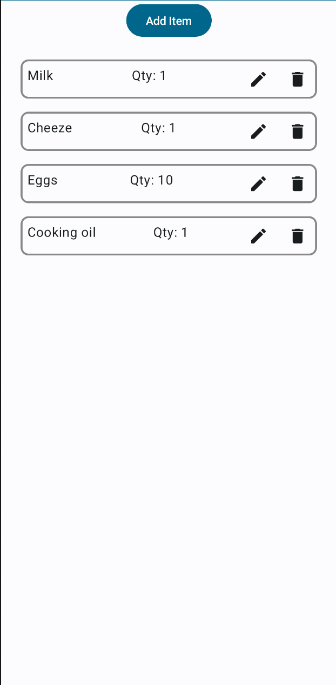
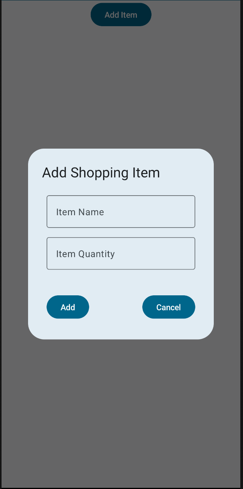
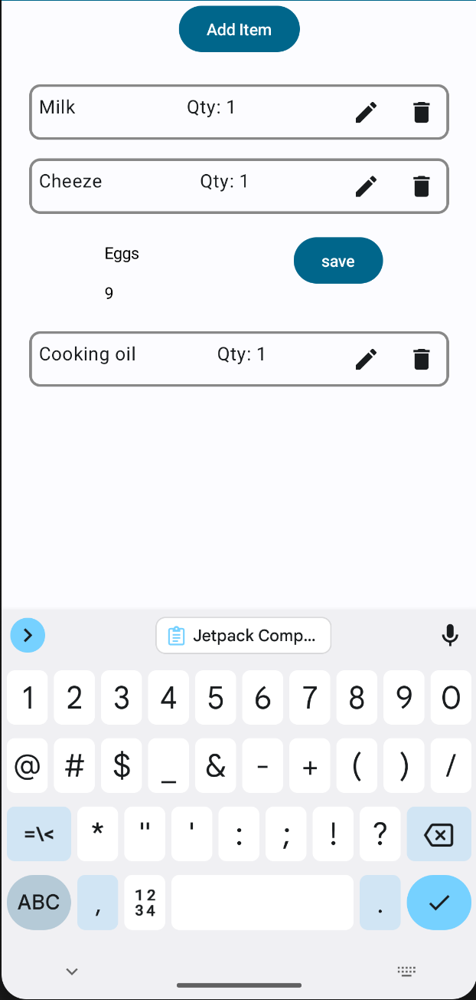

# Shopping List App

## Overview
The Shopping List App is a simple Android application that allows users to create, manage, and organize their shopping lists. Users can add items to their list, specify quantities, edit existing items, and delete items they no longer need. This project is just to practice.

## Features
- **Add Items**: Easily add new items to your shopping list.
- **Specify Quantities**: Include quantities for each item to help with planning.
- **Edit Items**: Update item names or quantities as needed.
- **Delete Items**: Remove items from your list when they're no longer needed.
- **Simple and Intuitive Interface**: User-friendly design for easy navigation and usage.

## Technologies Used
- **Android Studio**: IDE for Android app development.
- **Kotlin**: Programming language used for building the app.
- **Jetpack Compose**: Jetpack Compose is Android’s recommended modern toolkit for building native UI.

## Screenshots

## Installation
1. Clone the repository to your local machine.
2. Open the project in Android Studio.
3. Build and run the application on an Android device or emulator.

## Usage
1. Launch the app on your Android device.
2. Tap the "Add Item" button to add a new item to your shopping list.
3. Enter the name of the item and specify the quantity.
4. Tap "Add" to add the item to your list.
5. To edit or delete an item, Tap on appropriate icons.